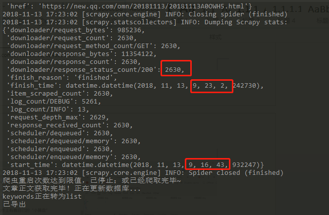

# newsqq
>- 使用Scrapy框架获取当日腾讯新闻的各类新闻链接、相关信息、正文等；
>- 数据库为MongoDB，获取的数据量约为2700条，用时约6分钟，具备断点续传、数据监控、导出csv、json、excel等功能； 
>- 运行：执行[main.py][1]即可，会自动执行如下操作：
>>1. 清空数据库
>>2. 运行[genLinks.py][2]生成需获取的所有页面链接，为9大类型，共135个页面链接
>>3. 执行第一个爬虫：scrapy crawl [links_spider][3]，获取所有页面的新闻链接及相关信息，约2700条数据
>>4. 运行[autoRestart.py][4]获取所有新闻的正文（会执行第二个爬虫：[article_spider][5]），如果中途中断会自动重新获取剩下的正文
>>5. 运行[linksAndArticleToExcel.py][6]，会将两个爬虫获取的数据进行整合，并将所有数据导出到excel  

[1]:./main.py
[2]:./genLinks.py
[3]:./newsqq/spiders/links_spider.py
[4]:./autoRestart.py
[5]:./newsqq/spiders/article_spider.py
[6]:./linksAndArticleToExcel.py
